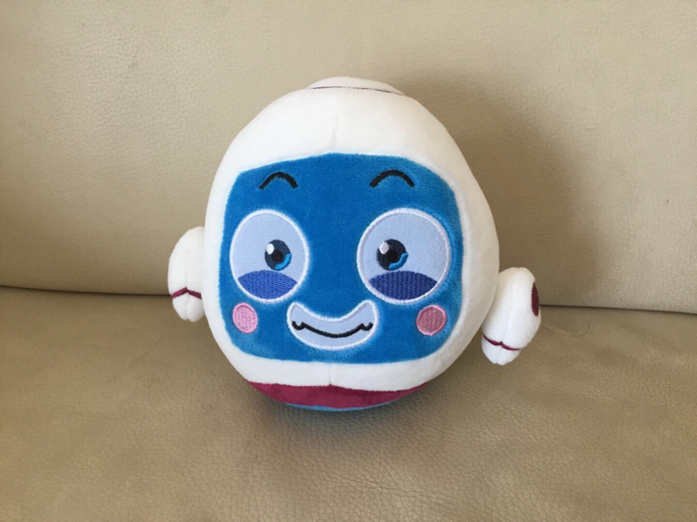
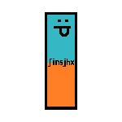
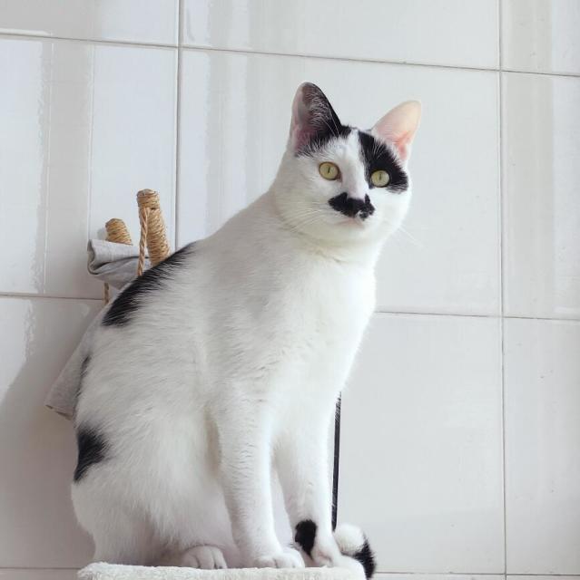
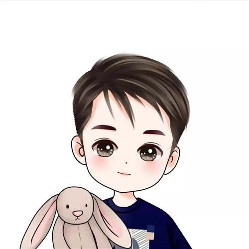
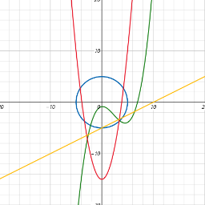

  <!-- 卡片 1 -->
  <a href="" style="text-decoration: none; color: inherit; display: block; border: 1px solid #e1e4e8; border-radius: 12px; padding: 16px; width: 150px; text-align: center; background: #fff; box-shadow: 0 2px 4px rgba(0,0,0,0.05); transition: transform 0.2s;">
    
    
Protactinium_

  </a>
  <!-- 卡片 2 -->
  <a href="" style="text-decoration: none; color: inherit; display: block; border: 1px solid #e1e4e8; border-radius: 12px; padding: 16px; width: 150px; text-align: center; background: #fff; box-shadow: 0 2px 4px rgba(0,0,0,0.05); transition: transform 0.2s;">
    
    
有思想的不定积分

  </a>
  <!-- 卡片 3 -->
  <a href="" style="text-decoration: none; color: inherit; display: block; border: 1px solid #e1e4e8; border-radius: 12px; padding: 16px; width: 150px; text-align: center; background: #fff; box-shadow: 0 2px 4px rgba(0,0,0,0.05); transition: transform 0.2s;">
    
    
ChenifyDev （旧号）

  </a>
  <!-- 卡片 4 -->
  <a href="" style="text-decoration: none; color: inherit; display: block; border: 1px solid #e1e4e8; border-radius: 12px; padding: 16px; width: 150px; text-align: center; background: #fff; box-shadow: 0 2px 4px rgba(0,0,0,0.05); transition: transform 0.2s;">
    
    
自由能

  </a>
  <!-- 卡片 5 -->
  <a href="" style="text-decoration: none; color: inherit; display: block; border: 1px solid #e1e4e8; border-radius: 12px; padding: 16px; width: 150px; text-align: center; background: #fff; box-shadow: 0 2px 4px rgba(0,0,0,0.05); transition: transform 0.2s;">
    
    
胡锦辉

  </a>
  <!-- 卡片 6 -->
  <a href="" style="text-decoration: none; color: inherit; display: block; border: 1px solid #e1e4e8; border-radius: 12px; padding: 16px; width: 150px; text-align: center; background: #fff; box-shadow: 0 2px 4px rgba(0,0,0,0.05); transition: transform 0.2s;">
    
    
Hdwyj

  </a>
  <!-- 卡片 7 -->
  <a href="" style="text-decoration: none; color: inherit; display: block; border: 1px solid #e1e4e8; border-radius: 12px; padding: 16px; width: 150px; text-align: center; background: #fff; box-shadow: 0 2px 4px rgba(0,0,0,0.05); transition: transform 0.2s;">
    
    
鱼翔浅底

  </a>
  <!-- 卡片 8 -->
  <a href="" style="text-decoration: none; color: inherit; display: block; border: 1px solid #e1e4e8; border-radius: 12px; padding: 16px; width: 150px; text-align: center; background: #fff; box-shadow: 0 2px 4px rgba(0,0,0,0.05); transition: transform 0.2s;">
    
    
云开霁散

  </a>
  <!-- 卡片 9 -->
  <a href="" style="text-decoration: none; color: inherit; display: block; border: 1px solid #e1e4e8; border-radius: 12px; padding: 16px; width: 150px; text-align: center; background: #fff; box-shadow: 0 2px 4px rgba(0,0,0,0.05); transition: transform 0.2s;">
    
    
Yzx's-|竹|

  </a>
  <!-- 卡片 10 -->
  <a href="" style="text-decoration: none; color: inherit; display: block; border: 1px solid #e1e4e8; border-radius: 12px; padding: 16px; width: 150px; text-align: center; background: #fff; box-shadow: 0 2px 4px rgba(0,0,0,0.05); transition: transform 0.2s;">
    
    
实变函数

  </a>

